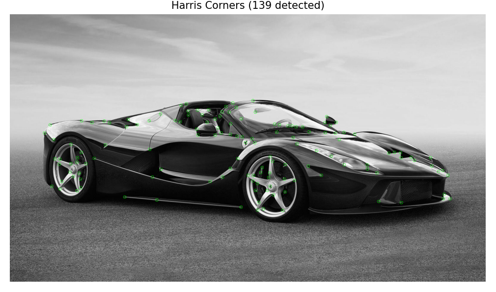
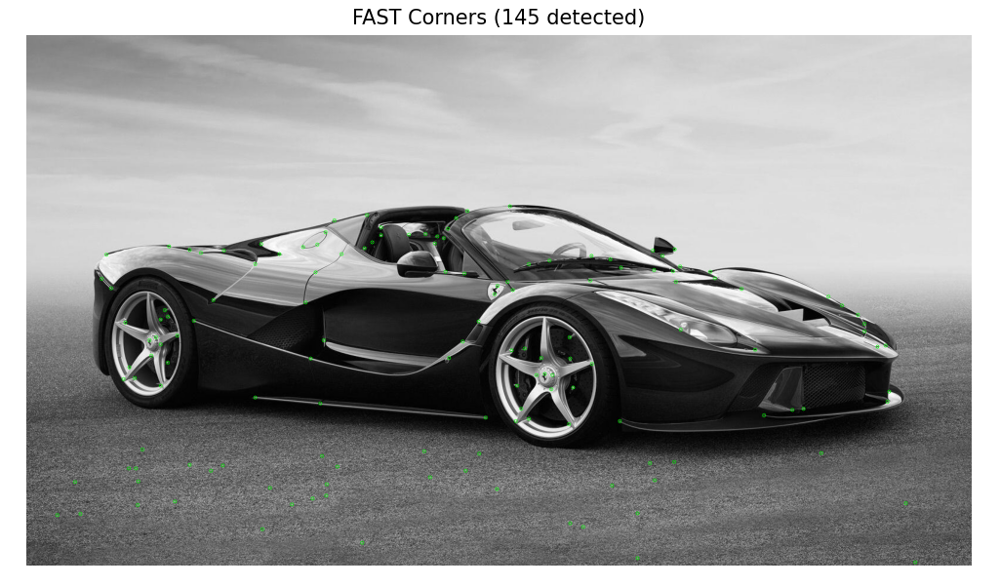
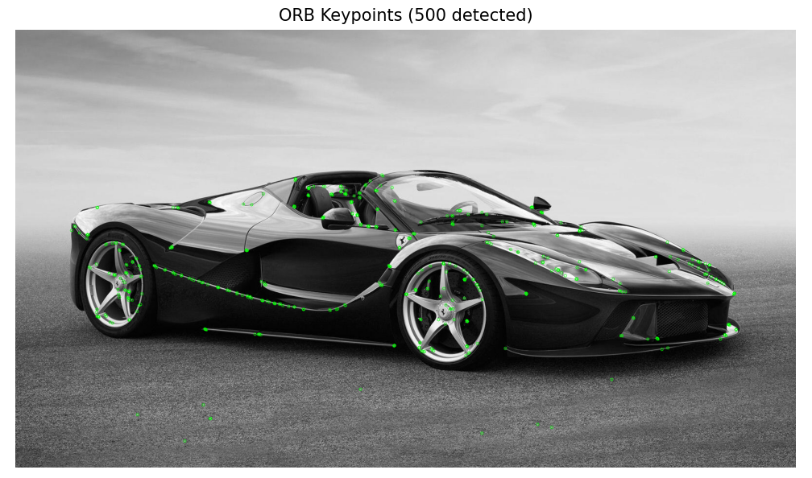
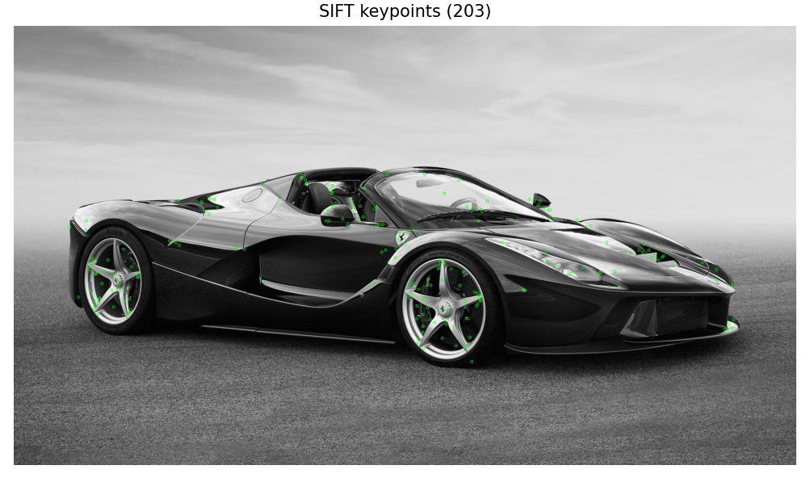
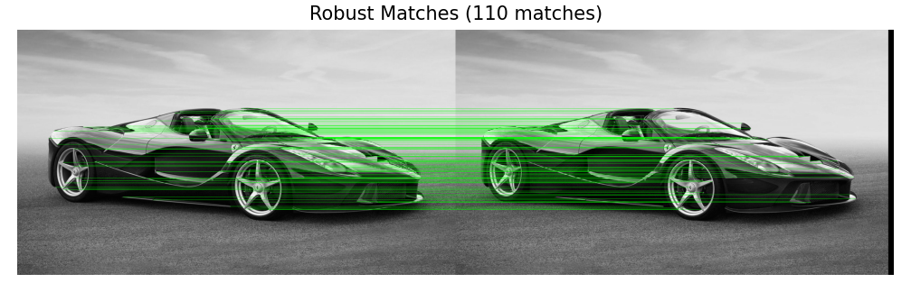
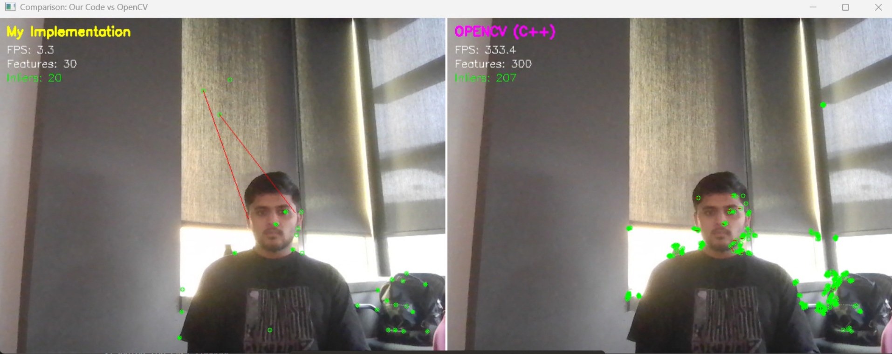

## Feature Detection & Matching

**Building Visual SLAM from Scratch - Educational Implementation**

Understanding how computers "see" and track features in images by implementing classic computer vision algorithms from scratch in Python.

---

## 📚 What's Inside

This chapter implements the fundamental building blocks of Visual SLAM: **detecting where interesting points are** (detection) and **describing what they look like** (description) so we can match them across images.

## 📸 Visual Examples

### Feature Detection

### Feature Matching

### Video Tracking

---

## 🎯 Philosophy

**Educational over Efficient**
- Clear variable names over cryptic abbreviations
- Explicit loops over vectorized magic
- Comments explaining the "why", not just the "what"
- Each algorithm in its own file for clarity

**Understanding over Optimization**
- Readable Python over fast C++
- Native loops over NumPy tricks (when it aids clarity)
- Step-by-step visualization
- Compare with OpenCV to verify correctness

---

## 🎓 Learning Path

### Beginner: Start Here
1. **`harris.py`** - Understand corner detection basics
2. **`fast.py`** - See real-time detection
3. **`brief.py`** - Learn binary descriptors
4. **`matching.py`** - Understand the filtering pipeline

### Next
1. **`orb.py`** - See how rotation invariance works
2. **`gaussian_pyramid.py`** - Multi-scale representation
3. **`ransac.py`** - Geometric verification
4. **`video_tracker_compare.py`** - Compare implementations

### Can try
1. Implement SIFT from scratch
2. Try different matching strategies
3. Optimize with NumPy vectorization
4. Port to C++ for speed

---

## 🔗 What's Next:

With feature matching working, we can now:
- **Estimate fundamental matrix** (epipolar geometry)
- **Use RANSAC** for robust estimation
- **Compute essential matrix** (calibrated geometry)
- **Prepare for 3D reconstruction!**

---

## 📚 References

### Papers Implemented
- Harris & Stephens (1988): "A Combined Corner and Edge Detector"
- Shi & Tomasi (1994): "Good Features to Track"
- Rosten & Drummond (2006): "Machine Learning for High-Speed Corner Detection"
- Calonder et al. (2010): "BRIEF: Binary Robust Independent Elementary Features"
- Rublee et al. (2011): "ORB: An Efficient Alternative to SIFT or SURF"

### Learning Resources
- Multiple View Geometry (Hartley & Zisserman)
- Computer Vision: Algorithms and Applications (Szeliski)
- OpenCV Documentation

---

## 🤝 Contributing

This is an educational project! If you:
- Find bugs or unclear code
- Have suggestions for better explanations
- Want to add more algorithms
- Improve visualizations

Feel free to reach out or suggest improvements!

---

## 📝 License

Educational use. Code is meant to be read, understood, and learned from.

---

---

**Built with curiosity. Shared for learning. 🚀**

*If you're learning Computer Vision or SLAM, feel free to use this code and reach out with questions!*
